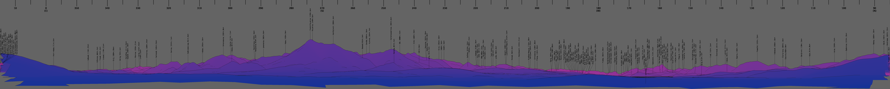
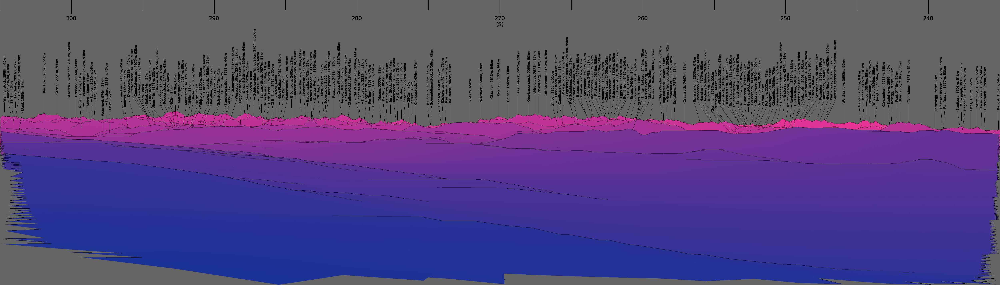

# Computationally generated mountain panoramas

## About artpano

Artpano (artificial panoramas) takes elevation data from SRTM/NASA or
viewfinderpanoramas as well as data about peak names and elevations and
coastlines from openstreetmap.

Using the elevation data and a user-chosen position + direction a panorama is
generated and labelled using the openstreemap data.

## Examples

An example from Slovakia:

An example from Zurich/Switzerland:

## Related resources

Similar or related functionality can be found at [viewfinderpanoramas](http://viewfinderpanoramas.org)
(+ a lot of useful information/data), [peakfinder](https://www.peakfinder.org) (+ a great app),
or [heywhatsthat](http://www.heywhatsthat.com).
