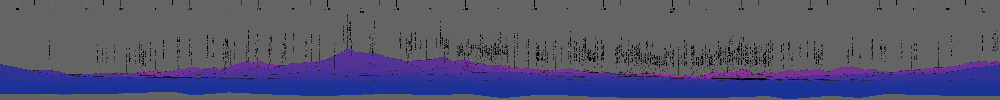
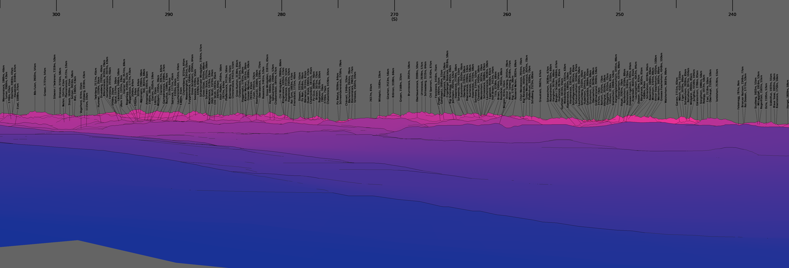

# Computationally generated mountain panoramas

## About artpano

Artpano (artificial panoramas) takes elevation data from SRTM/NASA or
viewfinderpanoramas as well as data about peak names and elevations and
coastlines from openstreetmap.

Using the elevation data and a user-chosen position + direction a panorama is
generated and labelled using the openstreemap data.

## Building

```
mkdir build;
cd build;
cmake ..;
make
```

## Examples

An example from Liptovsky Mikulas/Slovakia:
```
./artpano.py --lat 49.07980 --lon 19.62611 --view-dir-h 230 --view-width 290 --view-dir-v 8 --range 40 --canvas-height 1000 --canvas-width 10000
artpano --lat 49.07980 --lon 19.62611 --view-dir-h 230 --view-width 290 --view-dir-v 8 --range 40 --canvas-height 1000 --canvas-width 10000
```


An example from Zurich/Switzerland:
```
./artpano.py --lat 47.38242 --lon 8.56752 --view-dir-h 270 --view-width 70 --range 110 --canvas-height 1700 --canvas-width 5000
artpano --lat 47.38242 --lon 8.56752 --view-dir-h 270 --view-width 70 --range 110 --canvas-height 1700 --canvas-width 5000
```



## Related resources

Similar or related functionality can be found at [viewfinderpanoramas](http://viewfinderpanoramas.org)
(+ a lot of useful information/data), [peakfinder](https://www.peakfinder.org) (+ a great app),
or [heywhatsthat](http://www.heywhatsthat.com).

